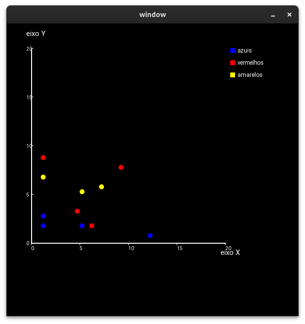
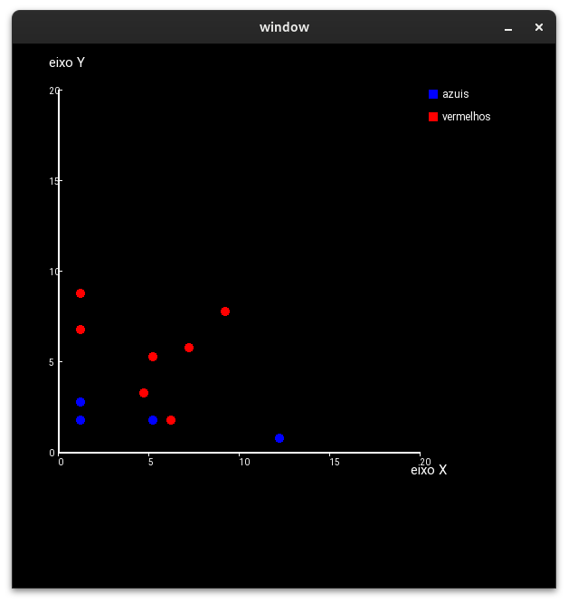
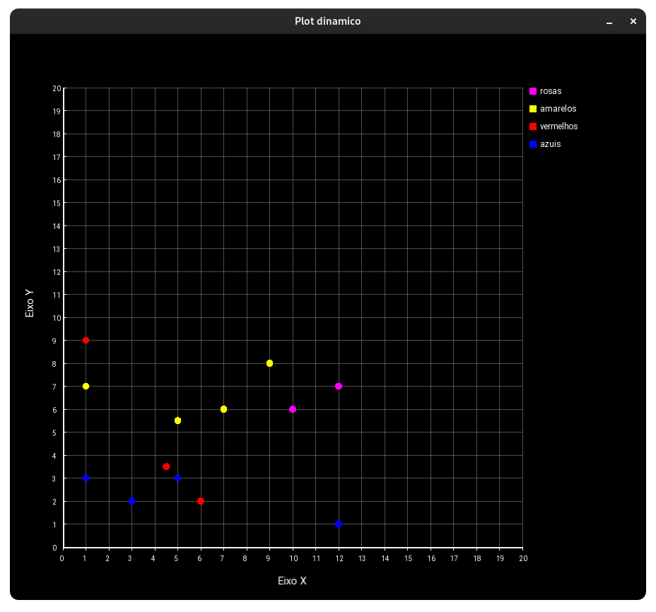
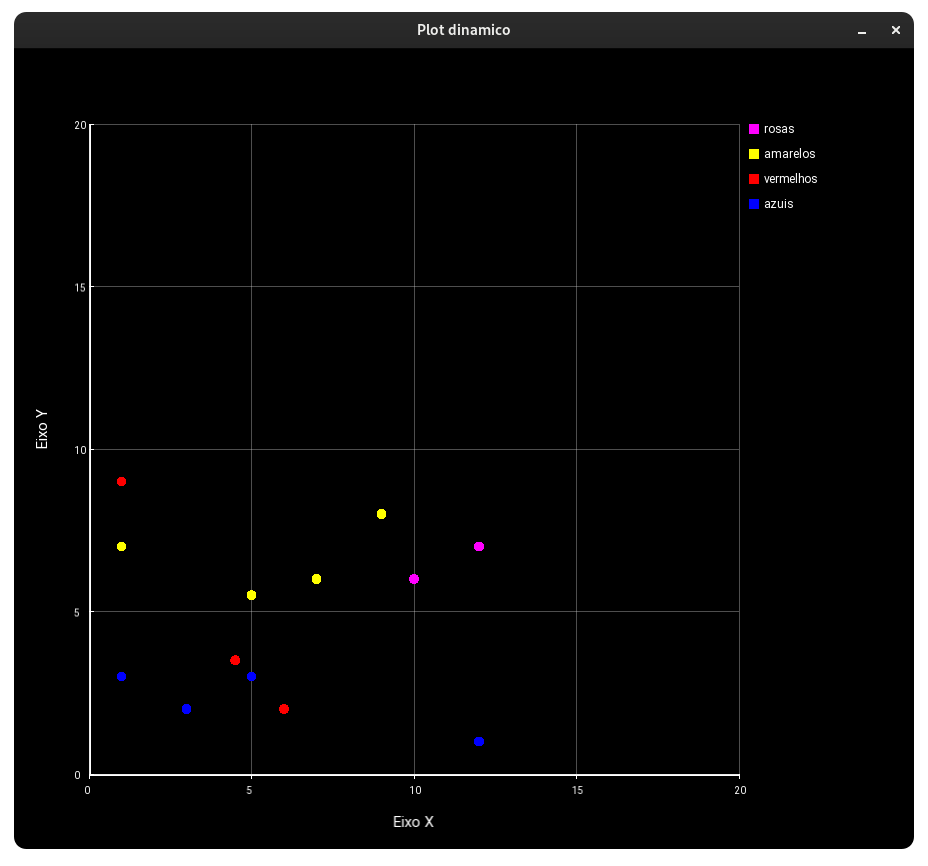
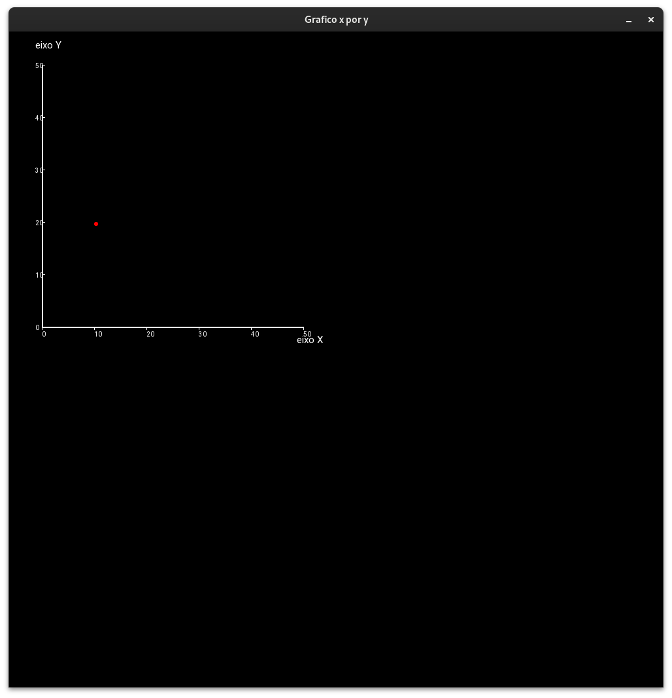
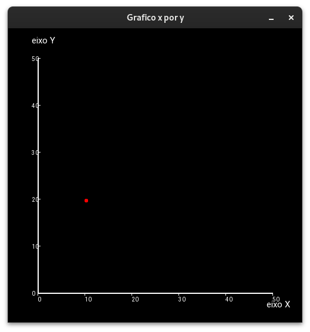
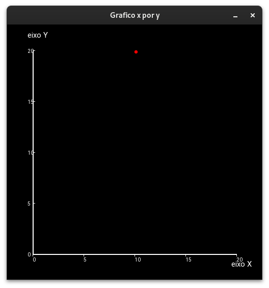
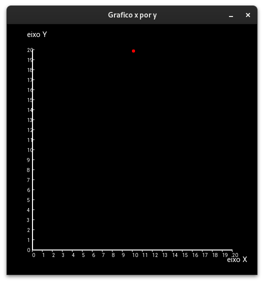
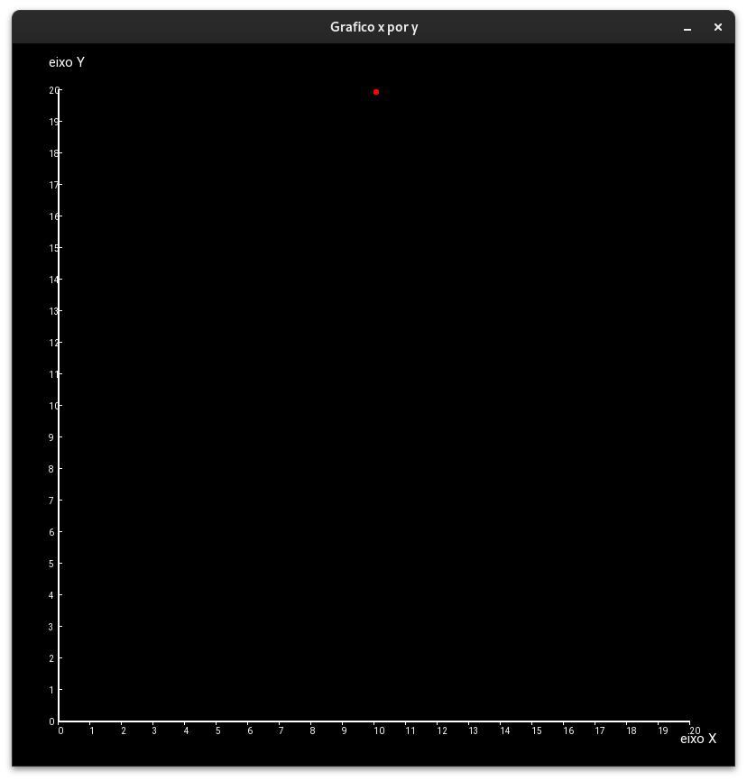

# PlotCpp

Aplicação gráfica simples para fins de aprendizado/relembrar a linguagem C++ em conjunto da biblioteca gráfica SFML (Simple and Fast Multimedia Library).

- **Scatter.hpp**: Declaração da classe `Scatter`.
- **Scatter.cpp**: Implementação da classe `Scatter` capaz de plotar uma lista de conjuntos pontos representados por pares <float,float>, devidamente mapeados.
- **Makefile**: Arquivo de configuração para compilação do projeto.

## Requisitos

- SFML (Simple and Fast Multimedia Library)
- gcc/g++
- make (se quiser compilar pelo makefile)

## Compilação e Execução

### Utilizando o Makefile

1. **Compilar o Projeto**
   Execute o comando abaixo para compilar o projeto:
   ~~~sh
   make

2. **Executar**
    Após a compilação, execute:
    ~~~sh
    ./Bin/exec

3. **Limpar Arquivos de Compilação**
    Para remover os arquivos objeto e o executável, execute:
    ~~~sh
    make clean

4. **Rebuild**
    Se quiser apenas compilar e rodar de uma vez
    ~~~sh
    make rebuild

## ScreenShots

